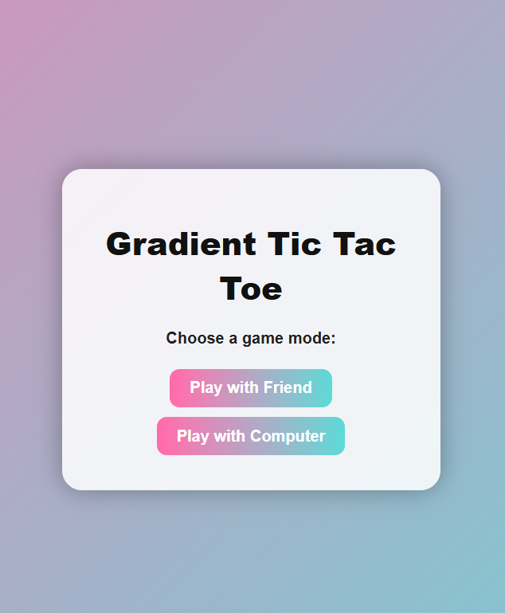
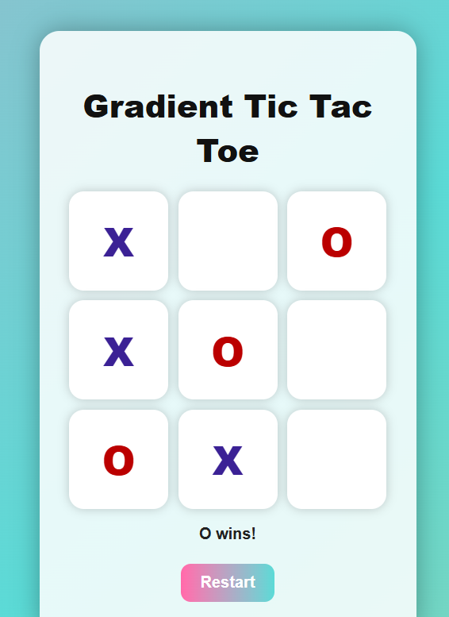

# TicX 🎮

TicX is a clean and interactive Tic Tac Toe application designed with a minimal, gradient-based UI.  
The app supports both **player-vs-player** and **player-vs-computer** modes, focusing on simplicity, usability, and reliable game logic.

---

## 📽️ Demo Video

▶️ Watch the app demo here:  
[Click to watch TicX Demo](https://github.com/Riya-Marjum/TicX_TicTacToe/releases/download/v1.0/demoticX.mp4
)

## 📱 App Screenshots

| Home Screen | Gameplay |
|------------|----------|
|  |  |

---

## ✨ Features

- Play with Friend (Player vs Player)
- Play with Computer
- Win and draw detection
- Restart game functionality
- Clean gradient-based UI
- Smooth and responsive gameplay

---

## 🛠️ Tech Stack

- **HTML**
- **CSS**
- **JavaScript**

---

## 🚀 How to Use

1. Clone the repository:
   ```bash
   git clone https://github.com/Riya-Marjum/TicX_TicTacToe.git

## 👩‍💻 Author

**Riya Marjum**

- GitHub: https://github.com/Riya-Marjum  
- LinkedIn: https://www.linkedin.com/in/riya-marjum/

